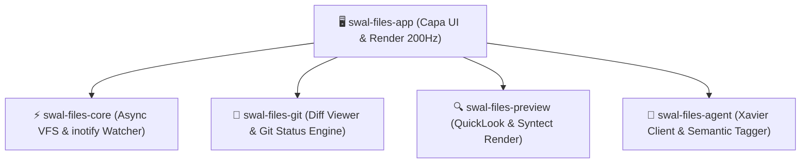

# SWAL Files — Arquitectura del Sistema (GitCore v3.8.0)

## 1. Visión y Principios de Diseño

1. **Rendimiento Máximo & Virtualización**: Cero sobrecarga de subprocesos o DOM pesado. Renderizado virtualizado por GPU con latencia sub-milisegundo.
2. **Estética Fluent Mica**: Translucidez cuidada, paleta `@swal/ui` y compatibilidad Wayland nativa.
3. **Ergonomía de macOS Finder**: Previsualizador instantáneo con `Spacebar` (QuickLook) y navegación jerárquica fluida.
4. **Control de Versiones Integrado**: Pestaña dedicada para inspeccionar diffs Git sin salir del explorador.
5. **Autonomía Agéntica**: Configuración declarativa en JSON y puente directo con Xavier Memory Core (`:8006`).

---

## 2. Diagrama de Módulos (Workspace de Rust)

---

## 3. Especificación de Crates

### 3.1 `crates/swal-files-core`
- **Responsabilidad**: Escaneo asíncrono no bloqueante con `walkdir` y `tokio::fs`.
- **Watcher**: Monitoreo de eventos en tiempo real con `notify` (`inotify` en Linux) para actualización instantánea sin polling.
- **Configuración**: Carga y guardado declarativo de `~/.config/swal/files/config.json`.

### 3.2 `crates/swal-files-git`
- **Responsabilidad**: Detección de repositorios Git, estado del working tree (`Modified`, `Staged`, `Untracked`).
- **Diff Engine**: Generación de diferencias unificadas y lado a lado (*side-by-side*) con resaltado de sintaxis.
- **Operaciones**: Stage/unstage selectivo de archivos y creación de commits (`Ctrl+Enter`).

### 3.3 `crates/swal-files-preview` (QuickLook)
- **Responsabilidad**: Decodificación y renderizado de previsualizaciones al presionar `Spacebar`.
- **Formatos**:
  - Código fuente: Resaltado con `syntect`.
  - Markdown: Parseo a HTML/AST con formato enriquecido.
  - Imágenes: Decodificación rápida con `image` / `resvg`.
  - Metadatos: EXIF, tamaño, hash SHA-256, permisos POSIX.

### 3.4 `crates/swal-files-agent`
- **Responsabilidad**: Comunicación asíncrona con Xavier Cognitive Core (`http://127.0.0.1:8006`).
- **Capacidades**: Indexación en base vectorial GraphRAG, búsqueda semántica por lenguaje natural y etiquetado automático.

### 3.5 `crates/swal-files-app`
- **Responsabilidad**: Punto de entrada de la aplicación de escritorio.
- **Componentes**:
  - `TabStrip`: Barra superior de pestañas con botones de cerrar y añadir (`Ctrl+T`, `Ctrl+W`).
  - `Omnibar`: Migas de pan interactivas y paleta de comandos agénticos (`Ctrl+L`).
  - `Sidebar`: Favoritos, Espacios de Trabajo, Unidades y Etiquetas AI.
  - `FileView`: Tabla virtualizada con vista de Detalles, Cuadrícula y Columnas.
  - `GitTab`: Vista dedicada de control de cambios.
